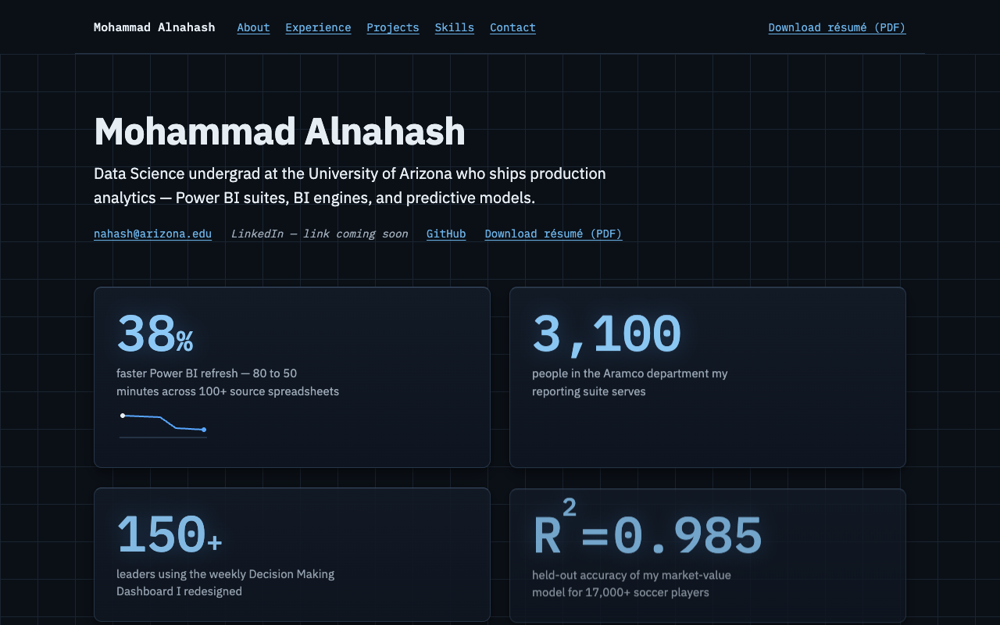

# mohammad-alnahash — portfolio site

**Live: [malnahash.github.io](https://malnahash.github.io)**

Personal portfolio, served by GitHub Pages at `https://malnahash.github.io`.

Plain static HTML/CSS plus one tiny script. **No framework, no build step.** Edit the files, push to `main`, and GitHub Pages redeploys automatically in about a minute. Dark control-room theme; design tokens live at the top of `styles.css`.

## Files

| File | What it is |
|---|---|
| `index.html` | The whole site — all content lives here |
| `styles.css` | All styling; design tokens are CSS variables at the top |
| `script.js` | Pointer tilt on cards — progressive enhancement, motion-gated |
| `assets/Mohammad_Alnahash_Resume.pdf` | Résumé linked from header + contact |
| `assets/og.png` | Link-preview image (LinkedIn/social) |
| `assets/fonts/` | Self-hosted IBM Plex Sans + Mono (woff2) — no third-party font requests |
| `og-source.html` | Source for `assets/og.png` — open at 1200×630 and screenshot to regenerate |

## How to edit

Open `index.html`, change the text, commit, push. That's it. Colors and fonts are defined once at the top of `styles.css` under `:root`.

To preview locally: `python3 -m http.server` in the repo root, then open `http://localhost:8000`.

## TODOs (search `TODO` in index.html)

- [ ] **LinkedIn URL** — replace the two "LinkedIn — link coming soon" spans with real links
- [ ] **Project links** — Moneyball: repo + write-up; LLM Benchmarks: repo + write-up; VINRecordHub: live site URL
- [ ] **Interests** — review the section; one open slot for a fourth item
- [ ] **xG project** — currently a one-line entry; consider promoting to a full fourth card
- [ ] **Phone number** — deliberately left off the public site (it's on the PDF); add only if you want it scraped

The "coming soon" placeholders are plain text, not dead links — replace each `…` with `<a href="…">…</a>` when a URL exists.

## License

Code is [MIT](LICENSE). Personal content — text, images, the résumé — is not; all rights reserved.
